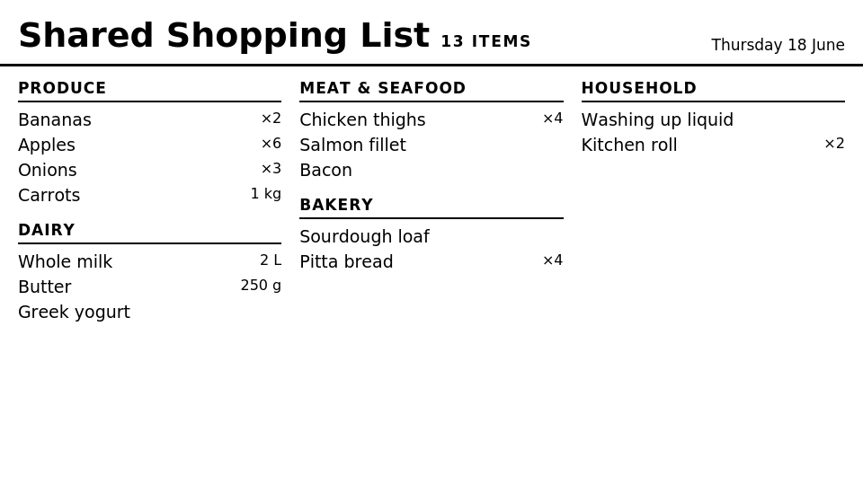
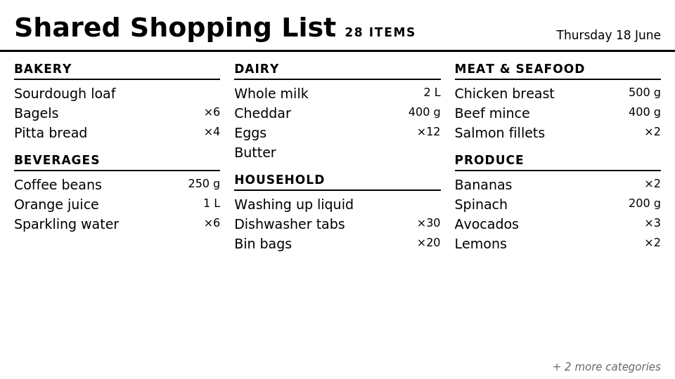
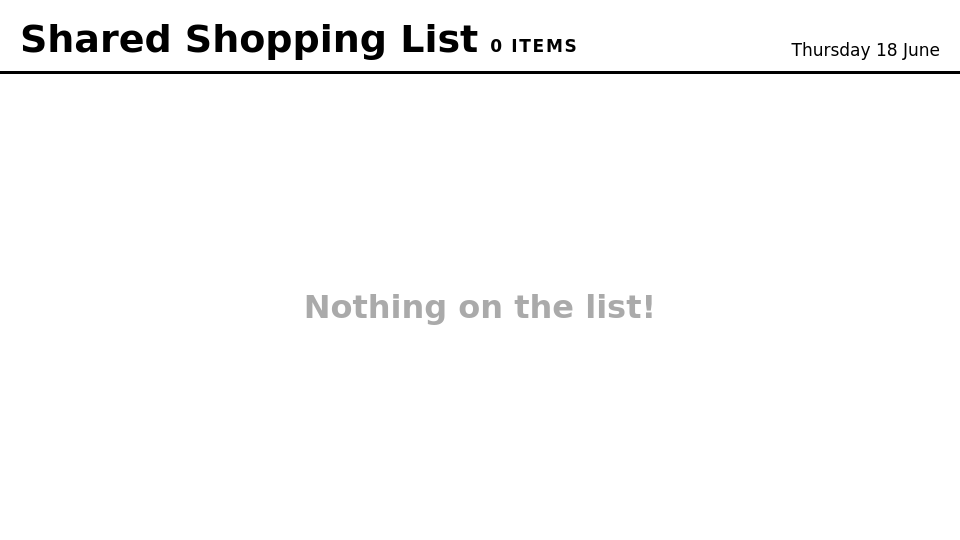

# trmnl-anylist

Display your [AnyList](https://www.anylist.com/) shopping list on a [TRMNL](https://trmnl.com/) e-ink display.

> **Unofficial.** AnyList has no public API. This project uses the same reverse-engineered
> protobuf API as [`ha-anylist`](https://github.com/ozonejunkieau/ha-anylist) and the
> [`anylist` npm package](https://github.com/codetheweb/anylist). It may break without notice
> if AnyList changes their API.

---

## Screenshots

**Typical weekly shop** — items grouped by category across three columns:



**Large shop** — when categories exceed the screen, a count of hidden categories appears bottom-right:



**Empty list** — shown when all items are checked off:



---

## Architecture

```
┌──────────────────────────┐  JSON GET /api/v1/list  ┌────────────────────────┐
│   trmnl-anylist-api      │ ◄────────────────────── │   TRMNL Recipe          │
│   (Node/Express Docker)  │                          │   (Liquid templates)    │
│   Port 3457 on your NAS  │                          │   polling every 15 min  │
└──────────────────────────┘                          └────────────────────────┘
         │
         │ AnyList undocumented API
         ▼
   anylist.com
```

The sidecar handles authentication and returns only unchecked items, grouped by category.
TRMNL polls it on your chosen interval.

---

## Prerequisites

- Docker + Portainer on your NAS (or any host reachable by TRMNL)
- An AnyList account with a shopping list
- TRMNL device with LaraPaper BYOS **or** a cloud TRMNL account (Developer licence)

---

## 1 — Generate an API token

The sidecar is protected by a static bearer token. Generate one now and keep it safe:

```bash
node -e "console.log(require('crypto').randomBytes(32).toString('hex'))"
```

Or on any machine with OpenSSL:

```bash
openssl rand -hex 32
```

---

## 2 — Deploy the API sidecar

### Option A — docker compose (local/NAS)

```bash
# 1. Copy and fill in the env file — this is NEVER committed to git
cp api/.env.example .env
nano .env

# 2. Build the image manually (required if using Portainer on NAS)
docker build -t trmnl-anylist-api:latest ./api

# 3. Start
docker compose up -d

# 4. Verify
curl http://localhost:3457/health
curl -H "Authorization: Bearer YOUR_TOKEN" http://localhost:3457/api/v1/list
```

### Option B — Portainer stack on NAS

Build the image manually over SSH first:

```bash
docker build -t trmnl-anylist-api:latest /path/to/trmnl-anylist/api
```

Then deploy a Portainer stack with this compose (paste into the editor, set env vars in Portainer's environment editor):

```yaml
services:
  trmnl-anylist-api:
    image: trmnl-anylist-api:latest
    container_name: trmnl-anylist-api
    restart: unless-stopped
    ports:
      - "3457:3457"
    environment:
      - ANYLIST_EMAIL=your-email@example.com
      - ANYLIST_PASSWORD=your-password
      - API_TOKEN=your-token-from-step-1
      - ANYLIST_LIST_NAME=Groceries
```

> **Security:** Set env vars in Portainer's stack environment editor. Never put credentials in a YAML file you commit anywhere.

---

## 3 — Install the TRMNL recipe

### LaraPaper BYOS

Create a polling plugin via the LaraPaper UI:

| Field | Value |
|---|---|
| Strategy | Polling |
| Polling URL | `http://YOUR_NAS_IP:3457/api/v1/list` |
| Polling Headers | `authorization: Bearer YOUR_TOKEN` |
| Refresh interval | 900s |

Paste the contents of `recipe/src/full.liquid` into the Markup editor.

### Cloud TRMNL

1. Create a Private Plugin and set the polling URL and header as above
2. Optionally click **Publish as Recipe** to share with the community

### trmnlp (local dev / push)

```bash
cd recipe
export TRMNL_API_KEY=your-trmnl-api-key
export API_TOKEN=your-sidecar-token

trmnlp serve   # preview at http://localhost:4567
trmnlp push    # upload to TRMNL
```

---

## API reference

### `GET /health`

No auth required.

```json
{ "status": "ok", "timestamp": "2026-06-17T10:30:00.000Z" }
```

### `GET /api/v1/list?name=Groceries`

Requires `Authorization: Bearer <token>` header.

```json
{
  "list_name": "Groceries",
  "item_count": 5,
  "categories": [
    {
      "name": "Dairy",
      "items": [
        { "name": "Milk", "quantity": "2 L", "details": "" },
        { "name": "Butter", "quantity": "250 g", "details": "" }
      ]
    }
  ],
  "updated_at": "2026-06-17T10:30:00.000Z"
}
```

- Checked items are always excluded.
- Categories sorted alphabetically; `Other` sorts last.
- The `?name=` query param is optional — defaults to `ANYLIST_LIST_NAME` env var.
- List names with spaces must be quoted in `.env`: `ANYLIST_LIST_NAME="My Shopping List"`

---

## Configuration

| Variable | Required | Default | Description |
|---|---|---|---|
| `ANYLIST_EMAIL` | Yes | — | AnyList account email |
| `ANYLIST_PASSWORD` | Yes | — | AnyList account password |
| `API_TOKEN` | Strongly recommended | — | Bearer token for the sidecar API |
| `ANYLIST_LIST_NAME` | No | `Groceries` | Default list if `?name=` is omitted |
| `PORT` | No | `3457` | Port the server listens on |

---

## Security notes

- `.env` is git-ignored. Only `.env.example` (with placeholder values) is committed.
- The API token prevents anyone on your LAN from reading your shopping list.
- AnyList credentials are never exposed via the API — they stay server-side.
- The sidecar runs as a non-root user inside the container.
- Do not expose port 3457 to the internet. Designed for LAN / Tailscale access only.

---

## Disclaimer

This project is not affiliated with or endorsed by AnyList. It uses an undocumented, unofficial API
that AnyList may change or block at any time. Use at your own risk. The `anylist` npm package
(MIT licence) does the heavy lifting.
